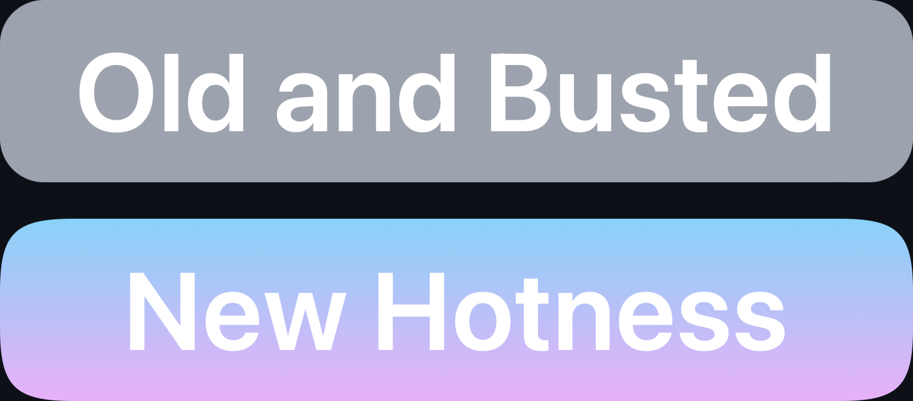

# html-squircle

<picture>
  <source media="(prefers-color-scheme: dark)" srcset="example-dark.png">
  <source media="(prefers-color-scheme: light)" srcset="example-light.png">
  
</picture>

`html-squircle` is a lightweight, framework-agnostic JavaScript package designed to create
superellipse squircles (smooth, rounded shapes) that can be used as SVG clip paths or backgrounds
for web elements. This package is perfect for developers looking to add modern, beautifully-rounded
corners to the web with minimal effort.

## Features

-   Generate squircles as SVG strings for use in `clip-path` or `background` inline styles.
-   Unlike a true superellipse, transitions gracefully into straight edges, making it suitable for
    UI elements of various sizes.
-   Customizable curve length, curve sharpness, background (solid color or gradient), stroke color,
    and stroke width.
-   Easy to use with any web framework or vanilla JavaScript.

## Installation

You can install `html-squircle` directly into your project using npm:

```zsh
npm install html-squircle
```

## Usage

After installing `html-squircle`, you can import and use it in your project as follows:

```js
import { clipSquircle, bgSquircle } from "html-squircle"

// Example usage for a clip path
const clipPathStyle = clipSquircle({
    bgWidth: 200,
    bgHeight: 200
})

// Example usage for a background with a solid color
const backgroundStyle = bgSquircle({
    bgWidth: 200,
    bgHeight: 200,
    svgBackground: "#ff6347", // Tomato color
    svgStroke: "black",
    svgStrokeWidth: 2
})

// Apply the generated styles to your elements
document.getElementById("yourElementId").style.clipPath = clipPathStyle
document.getElementById("anotherElementId").style.background = backgroundStyle
```

The `clipSquircle` and `bgSquircle` exports provide Apple-like default values to `curveLength` and
`curveSharpness`, such that square elements will look like app icons. It also makes the default
background white, with no stroke, and stroke width 1px. To create a pair of functions with defaults
adhering to your own design system, use the `newSquirclers` export and supply it with your own
preferences.

There is also the `getConstantCurveLength` export, which you can use as an input to the
`curveLength` parameter to define a curve length in pixels that will not change in response to the
size of the element.
