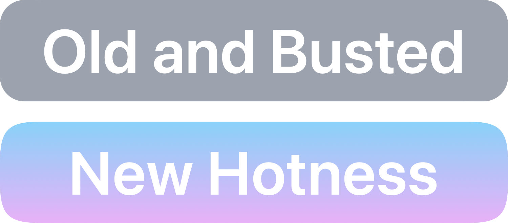

# html-squircle

<picture>
  <source media="(prefers-color-scheme: dark)" srcset="public/example-dark.png">
  <source media="(prefers-color-scheme: light)" srcset="public/example-light.png">
  
</picture>

`html-squircle` is a lightweight, framework-agnostic JavaScript package designed
to create superellipse squircles (smooth, rounded shapes) that can be used as
SVG clip paths or backgrounds for web elements. This package is perfect for
developers looking to add modern, beautifully-rounded corners to the web with
minimal effort.

## Features

- Generate squircles as SVG strings for use in `clip-path` or `background-image`
  inline styles.
- Unlike a true superellipse, transitions gracefully into straight edges, making
  it suitable for UI elements of various sizes.
- Customizable curve length, curve smoothness, background (solid color or
  gradient), stroke color, stroke width, and SVG injections to defs or body.
- Easy to use with any web framework or vanilla JavaScript.

## Installation

You can install `html-squircle` using npm:

```zsh
npm install html-squircle
```

## Usage

After installing `html-squircle`, you can import and use it in your project as
follows:

```ts
import { clipSquircle, backgroundSquircle } from "html-squircle"
import type { SquircleOptionsSVG } from "html-squircle"

const squircleSquare200: SquircleOptionsSVG = {
  width: 200,
  height: 200,
  stroke: "black",
  strokeWidth: 2,
  background: "#ff6347"
}

// Example usage for a clip path
const clipPathStyle = clipSquircle(squircleSquare200)
document.getElementById("yourElementId").style.clipPath = clipPathStyle

// Example usage for a background with a solid color
const backgroundStyle = backgroundSquircle(squircleSquare200)
document.getElementById("anotherElementId").style.backgroundImage =
  backgroundStyle
```

The default values for `curveLength` (calculated based on shortest side) and
`roundness` (0.2) will produce shapes exactly like Apple's app icons when the
`width` and `height` are equal.

## Tips

You may wish to memoize the functions with Lodash's `memoize`. The functions
take a single object as the arguments, so `memoize` will work with them right
out of the box. This will work well for statically-sized elements such as
buttons that could frequently change as a result of hover or active state, for
example. However, since you'll sometimes need to produce the options argument
inline or dynamically (such as with a measured `width` and `height`), you should
change the cache to `WeakMap` to avoid overloading memory.

When trying to control the sharpness of the curve, first adjust the
`curveLength` parameter. If you're not getting the result you want, then reach
for `roundness`.

The `backgroundSquircle` function is only really useful if you need to add a
stroke to your background (regular CSS `border` will be clipped if you use
`clip-path`), or if you need to do something else fancy with SVG (see below).

Use the `injectedDefs` and `injectedBody` params if you need to do anything
custom with the generated background SVG. This can either be a `string`, or a
`InjectionFunction`, which exposes the inner IDs of the other SVG elements,
enabling you to do things with the generated path, for example. To create xml
tag structures easily, you can use the exported `tag` function. For maximum
browser support and to align with the rest of the SVG result, always use single
quotes. Your input will be URI-encoded, so don't do this yourself.

The values can be partly animated with CSS. The width and height will smoothly
transition, but the curves will fade from one definition to the next.
